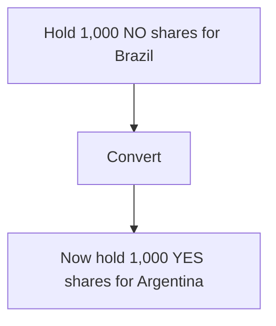

For markets with multiple possible outcomes (e.g. _"Which country wins the World Cup?"_), all NO shares are the same [SPL token](/architecture/spl-structure) across outcomes.

## Share Conversion

No additional capital required. You're just shifting your position across related outcomes within the same market.

## How It Works

In a multi-outcome market:

- Each outcome has YES and NO shares
- All NO shares across outcomes are identical SPL tokens
- Converting NO(Brazil) to YES(Argentina) = metadata update

Example:

- Market: "Which country wins the World Cup?"
- Brazil (YES/NO)
- Argentina (YES/NO)
- France (YES/NO)
- Germany (YES/NO) You hold 1,000 NO shares for Brazil. This means you believe Brazil won't win-someone else will. To convert to Argentina:

<Steps>
  <Step title="Burn 1,000 NO (Brazil)" titleSize="h3">
    
  </Step>
  <Step title="Mint 1,000 YES (Argentina)" titleSize="h3">
    
  </Step>
  <Step title="Zero additional capital" titleSize="h3">
    
  </Step>
</Steps>

Hedging Across Outcomes You can split risk:

- 500 NO (Brazil) → 500 YES (Argentina)
- 500 NO (Brazil) → 500 YES (France)

Cover multiple outcomes without locking more capital.