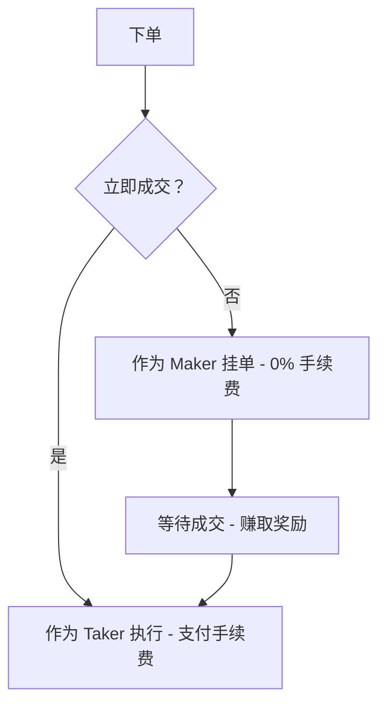

Space 基于 Solana 运行，采用中央限价订单簿（CLOB），用户之间直接交易。没有庄家，没有中间商，没有 AMM 曲线——只有透明的订单撮合和真实的价格发现。
## 订单簿运作原理

[Maker](/cn/concepts/makers-takers) 提交限价单，享受 0% 手续费并通过提供流动性赚取奖励。[Taker](/cn/concepts/makers-takers) 吃单执行，根据市场概率支付动态手续费。
订单按价格-时间优先级撮合。最优价格优先成交；价格相同时，最早的订单优先成交。
**订单生命周期**
- 用户提交市价单或限价单
- 撮合引擎检查是否有对手方
- 如果匹配成功 → 立即执行（taker）
- 如果没有匹配 → 加入订单簿（maker）
- 订单挂起直到成交、取消或过期
## 价格发现
价格由供需关系决定。所有订单在链上可见。订单簿完全透明——没有隐藏流动性，没有优先待遇。
