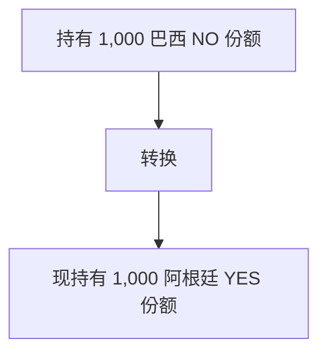

对于具有多个可能结果的市场（例如 _"哪个国家赢得世界杯？"_），所有 NO 份额在各结果之间都是相同的 [SPL 代币](/cn/architecture/spl-structure)。
## 份额转换

无需额外资金。您只是在同一市场内的相关结果之间转移头寸。
## 运作原理
在多结果市场中：
- 每个结果都有 YES 和 NO 份额
- 所有结果的 NO 份额都是相同的 SPL 代币
- 将 NO（巴西）转换为 YES（阿根廷）= 元数据更新
示例：
- 市场："哪个国家赢得世界杯？"
- 巴西（YES/NO）
- 阿根廷（YES/NO）
- 法国（YES/NO）
- 德国（YES/NO）您持有 1,000 巴西 NO 份额。这意味着您认为巴西不会赢——其他国家会赢。转换为阿根廷：
<Steps>
  <Step title="销毁 1,000 NO（巴西）" titleSize="h3">
    
  </Step>
  <Step title="铸造 1,000 YES（阿根廷）" titleSize="h3">
    
  </Step>
  <Step title="零额外资金" titleSize="h3">
    
  </Step>
</Steps>
跨结果对冲 您可以分散风险：
- 500 NO（巴西）→ 500 YES（阿根廷）
- 500 NO（巴西）→ 500 YES（法国）
覆盖多个结果而无需锁定更多资金。
