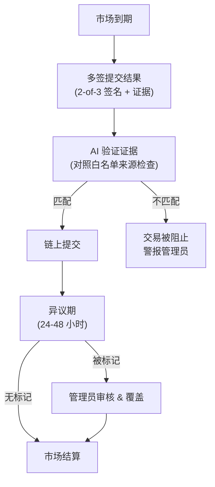

某些市场如政治、体育和文化市场可能使用混合结算流程，从预言机获取验证的真相。在某些情况下，预言机等待多个可信来源的确认——类似于在区块链上等待多个确认——以防止欺诈并确保准确性。
## 结算流程
<div align="center">

</div>
<Steps>
  <Step title="运营商多签" titleSize="h3">
    2-of-3 运营商多签提交结算，包括：
    - 市场 ID
    - 结果（YES/NO 或特定结果）
    - 证据 URL
    - 内容哈希
    - 时间戳
    - 3 个签名中的 2 个
  </Step>
  <Step title="AI 验证" titleSize="h3">
    AI 在链上提交前对照证据验证结果：
    - 解析证据来源
    - 与市场结算标准比较
    - 如不匹配则标记
    如果 AI 不同意，交易被阻止并警报管理员。
  </Step>
  <Step title="提交后检查" titleSize="h3">
    链上提交后，AI 再次验证：
    - 确认提交的结果与证据匹配
    - 如检测到差异则警报管理员
    - 启用异议期
  </Step>
  <Step title="异议期" titleSize="h3">
    24-48 小时（每个市场可配置）供社区审核：
    - 用户可以标记不正确的结算
    - 被标记的市场进入管理员审核
    - 如明显错误可覆盖
  </Step>
</Steps>
## 证据要求
**白名单来源：**
- 新闻：主要通讯社和知名新闻机构
- 体育：官方联赛来源和权威体育媒体
- 政府：官方 .gov 域名或国际等效
**要求：**
- 公开可访问的 URL
- 内容哈希存储在链上
- 在结算前有时间戳
- 存档以供验证
示例结算
```json
{
  "market_id": "us_election_2028",
  "outcome": "YES",
  "evidence": {
    "source": "https://fec.gov/updates/2028-election-results...",
    "content_hash": "0x7a3f9b2c...",
    "timestamp": "2028-11-06T04:32:00Z"
  },
  "signatures": [
    "operator_1_sig",
    "operator_2_sig"
  ]
}
```
