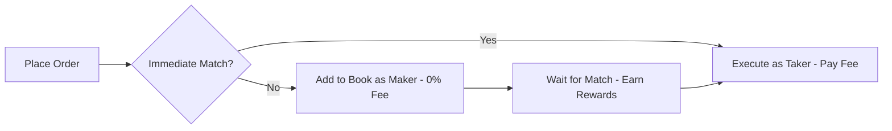

Space runs on Solana using a Central Limit Order Book (CLOB) where users trade directly against each other. No house, no middleman, no AMM curves-just transparent order matching and real price discovery.

## How the Order Book Works

**Makers** post limit orders and pay 0% fees. **Takers** hit existing orders and pay dynamic fees based on market probability.

Orders match on price-time priority. Best price gets filled first; equal prices fill oldest orders first.

**Order Lifecycle**
    - User places market or limit order
    - Matching engine checks for counterparty
    - If match found → execute immediately (taker)
    - If no match → add to order book (maker)
    - Order sits until matched, cancelled, or expired

## Price Discovery
Prices emerge from supply and demand. Every order is visible on-chain. The order book is transparent-no hidden liquidity, no preferential treatment.

