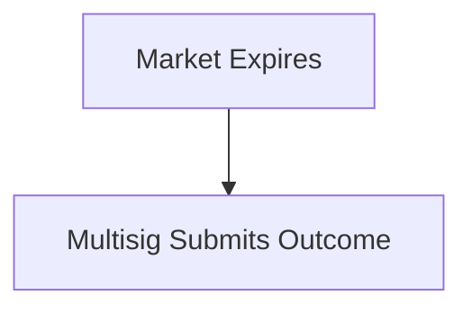

Politics, sports, and culture markets require human judgment. Space uses a combination of operator multisig and AI validation.

## Resolution Process
<div align="center">

</div>
<Steps>
  <Step title="Operator Multisig" titleSize="h3">
    2-of-3 operator multisig submits resolution including:
    - Market ID
    - Outcome (YES/NO or specific outcome)
    - Evidence URL
    - Content hash
    - Timestamp
    - 2 of 3 signatures
  </Step>
  <Step title="AI Validation" titleSize="h3">
    AI validates outcome against evidence before on-chain submission:
    - Parse evidence source
    - Compare to market resolution criteria
    - Flag if mismatch

    If AI disagrees, transaction is blocked and admins alerted.
  </Step>
  <Step title="Post-Submission Check" titleSize="h3">
    After on-chain submission, AI validates again:
    - Confirm submitted outcome matches evidence
    - Alert admins if discrepancy detected
    - Enable challenge period
  </Step>
  <Step title="Challenge Period" titleSize="h3">
    24-48 hours (configurable per market) for community review:
    - Users can flag incorrect resolutions
    - Flagged markets go to admin review
    - Override possible if clearly wrong
  </Step>
</Steps>
## Evidence Requirements
**Whitelisted Sources:**
- News: AP, Reuters, BBC, CNN
- Sports: ESPN, official league sources
- Government: Official .gov domains

**Requirements:**

- Publicly accessible URL
- Content hash stored on-chain
- Timestamped before resolution
- Archived for verification
Example Resolution
```json
{
  "market_id": "us_election_2028",
  "outcome": "YES",
  "evidence": {
    "source": "https://apnews.com/article/election-results...",
    "content_hash": "0x7a3f9b2c...",
    "timestamp": "2028-11-06T04:32:00Z"
  },
  "signatures": [
    "operator_1_sig",
    "operator_2_sig"
  ]
}
```
