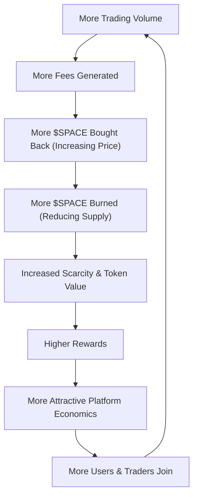

The mechanism creates a self-sustaining growth cycle:

Each component reinforces the others, creating compounding growth as the platform scales. The Flywheel Mechanism creates a virtuous cycle where platform success directly benefits token holders through:
- **Automated buybacks** using TWAP for optimal execution
- **Permanent burns** reducing supply continuously
- **Treasury funding** ensuring platform growth
- **Transparent operations** with public dashboard
- **Sustainable economics** balancing value return and development

As Space grows, the flywheel spins faster - more users generate more fees, driving larger burns, increasing scarcity, attracting more users, and perpetuating the cycle. This alignment of incentives between users, traders, liquidity providers, and token holders creates a foundation for Space’s long-term success. 

