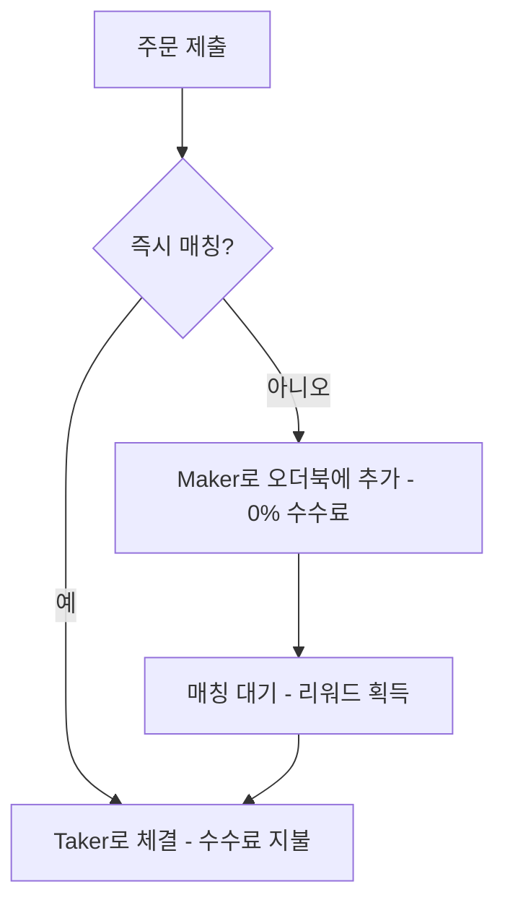

Space는 중앙 지정가 주문장(CLOB)을 사용하여 Solana에서 운영되며, 사용자들이 직접 거래합니다. 하우스도 없고, 중개인도 없고, AMM 곡선도 없습니다—투명한 주문 매칭과 실제 가격 발견만 있습니다.
## 오더북 작동 방식

[Maker](/ko/concepts/makers-takers)는 지정가 주문을 제출하고, 0% 수수료를 적용받으며 유동성 제공에 대한 리워드를 받습니다. [Taker](/ko/concepts/makers-takers)는 기존 주문을 체결하고 시장 확률에 따른 동적 수수료를 지불합니다.
주문은 가격-시간 우선순위로 매칭됩니다. 최적의 가격이 먼저 체결되고, 가격이 같으면 가장 오래된 주문이 먼저 체결됩니다.
**주문 생명주기**
- 사용자가 시장가 또는 지정가 주문 제출
- 매칭 엔진이 상대방 확인
- 매칭 발견 → 즉시 체결 (taker)
- 매칭 없음 → 오더북에 추가 (maker)
- 주문은 체결, 취소 또는 만료될 때까지 대기
## 가격 발견
가격은 수요와 공급에서 형성됩니다. 모든 주문은 온체인에서 확인 가능합니다. 오더북은 투명합니다—숨겨진 유동성도 없고, 우대도 없습니다.
