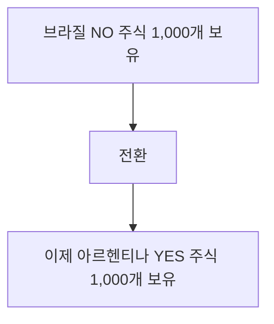

다중 결과가 가능한 마켓(예: _"어느 나라가 월드컵에서 우승할까?"_)의 경우, 모든 NO 주식은 결과 전반에 걸쳐 동일한 [SPL 토큰](/ko/architecture/spl-structure)입니다.
## 주식 전환

추가 자본이 필요 없습니다. 동일한 마켓 내에서 관련 결과 간에 포지션을 이동하는 것뿐입니다.
## 작동 방식
다중 결과 마켓에서:
- 각 결과에는 YES 및 NO 주식이 있음
- 모든 결과의 NO 주식은 동일한 SPL 토큰
- NO(브라질)를 YES(아르헨티나)로 전환 = 메타데이터 업데이트
예시:
- 마켓: "어느 나라가 월드컵에서 우승할까?"
- 브라질 (YES/NO)
- 아르헨티나 (YES/NO)
- 프랑스 (YES/NO)
- 독일 (YES/NO) 브라질 NO 주식 1,000개를 보유하고 있습니다. 이는 브라질이 우승하지 않을 것이라고 믿는다는 의미입니다—다른 나라가 우승할 것입니다. 아르헨티나로 전환하려면:
<Steps>
  <Step title="1,000 NO (브라질) 소각" titleSize="h3">
    
  </Step>
  <Step title="1,000 YES (아르헨티나) 발행" titleSize="h3">
    
  </Step>
  <Step title="추가 자본 없음" titleSize="h3">
    
  </Step>
</Steps>
결과 간 헤징 리스크를 분산할 수 있습니다:
- 500 NO (브라질) → 500 YES (아르헨티나)
- 500 NO (브라질) → 500 YES (프랑스)
더 많은 자본을 묶지 않고 여러 결과를 커버하세요.
