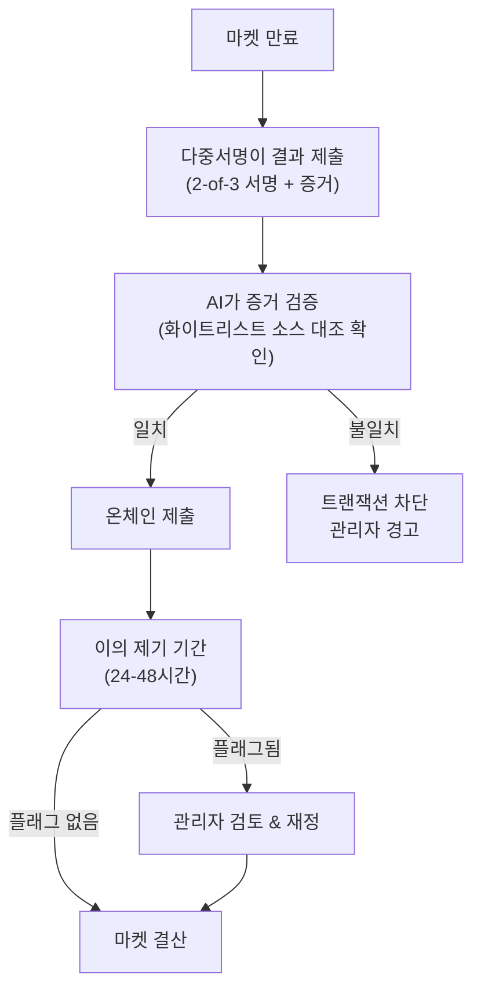

정치, 스포츠, 문화 마켓과 같은 일부 마켓은 오라클에서 검증된 진실을 소싱하는 하이브리드 결산 프로세스를 사용할 수 있습니다. 어떤 경우에는 오라클이 사기를 방지하고 정확성을 보장하기 위해 여러 신뢰할 수 있는 소스의 확인을 기다립니다 - 블록체인에서 여러 확인을 기다리는 것과 유사합니다.
## 결산 프로세스
<div align="center">

</div>
<Steps>
  <Step title="운영자 다중서명" titleSize="h3">
    2-of-3 운영자 다중서명이 결산을 제출하며 포함 내용:
    - 마켓 ID
    - 결과 (YES/NO 또는 특정 결과)
    - 증거 URL
    - 콘텐츠 해시
    - 타임스탬프
    - 3개 중 2개 서명
  </Step>
  <Step title="AI 검증" titleSize="h3">
    AI가 온체인 제출 전 증거 대비 결과를 검증:
    - 증거 소스 파싱
    - 마켓 결산 기준과 비교
    - 불일치 시 플래그
    AI가 동의하지 않으면 트랜잭션이 차단되고 관리자에게 경고됩니다.
  </Step>
  <Step title="제출 후 확인" titleSize="h3">
    온체인 제출 후 AI가 다시 검증:
    - 제출된 결과가 증거와 일치하는지 확인
    - 불일치 감지 시 관리자에게 경고
    - 이의 제기 기간 활성화
  </Step>
  <Step title="이의 제기 기간" titleSize="h3">
    커뮤니티 검토를 위한 24-48시간 (마켓별 구성 가능):
    - 사용자가 잘못된 결산을 플래그할 수 있음
    - 플래그된 마켓은 관리자 검토로 이동
    - 명백히 잘못된 경우 재정 가능
  </Step>
</Steps>
## 증거 요구사항
**화이트리스트 소스:**
- 뉴스: 주요 통신사 및 확립된 뉴스 기관
- 스포츠: 공식 리그 소스 및 평판 있는 스포츠 미디어
- 정부: 공식 .gov 도메인 또는 국제 동등물
**요구사항:**
- 공개적으로 접근 가능한 URL
- 온체인에 저장된 콘텐츠 해시
- 결산 전 타임스탬프
- 검증을 위해 보관됨
예시 결산
```json
{
  "market_id": "us_election_2028",
  "outcome": "YES",
  "evidence": {
    "source": "https://fec.gov/updates/2028-election-results...",
    "content_hash": "0x7a3f9b2c...",
    "timestamp": "2028-11-06T04:32:00Z"
  },
  "signatures": [
    "operator_1_sig",
    "operator_2_sig"
  ]
}
```
